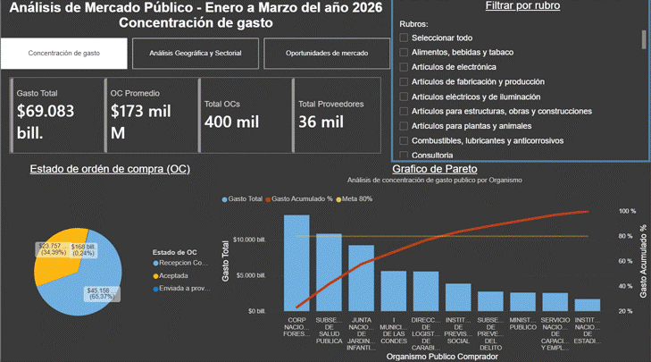

# Análisis del Gasto Público en Mercado Público Chile

**¿Cómo y dónde gasta el Estado chileno a través de Mercado Público, y dónde están las mejores oportunidades para un proveedor?**

Análisis Exploratorio de Datos (EDA) sobre ~1.1 millones de órdenes de compra públicas de Mercado Público (ChileCompra), estructurado en torno a una pregunta de negocio concreta: identificar patrones de gasto, concentración geográfica/sectorial y nichos de mercado accesibles para nuevos proveedores.

> 🛠️ **Stack:** Python · pandas · NumPy · Matplotlib · Seaborn · Jupyter · Power BI  
> 📊 **Tipo:** Análisis Exploratorio de Datos (EDA) con enfoque de negocio y pedagogía de datos  
> 🗂️ **Fuente:** Datos Abiertos de Mercado Público (ChileCompra)

---

## 🎯 Estructura de la Pregunta de Negocio

Para responder dónde conviene competir, la pregunta principal se desglosa en tres dimensiones analíticas fundamentales:

### 1. ¿Cómo gasta el Estado?
* **1.1 Concentración:** ¿El gasto está concentrado en pocos organismos o distribuido equitativamente?
* **1.2 Estructura transaccional:** ¿Se gasta de forma fragmentada (órdenes pequeñas masivas) o consolidada (grandes licitaciones)?
* **1.3 Competencia:** ¿Existen monopolios/oligopolios de facto o es un mercado abierto a la libre competencia?

### 2. ¿Dónde gasta el Estado?
* **2.1 Por Rubro:** Distribución del presupuesto por macro-sectores industriales (`rubro`).
* **2.2 Por Categoría:** Nivel de detalle por sub-categorías de productos/servicios (`categoria`).
* **2.3 Por Región:** Grado de centralización del gasto según la `region_de_compra`.

### 3. ¿Qué oportunidades tienen los proveedores?
* **3.1 Barreras de entrada por organismo:** Organismos con baja diversidad de proveedores.
* **3.2 Filtro de falsos nichos:** Identificación de categorías con alto gasto pero hiper-concentradas en pocos proveedores (mercados cautivos).
* **3.3 Nichos dinámicos:** Detección de sectores no saturados con alto flujo transaccional y liquidez distribuida por proveedor.

---

## 💡 Principales Hallazgos (Key Findings)

1. **Alta concentración en la cabeza del gasto (Regla de Pareto extrema):**
   * El **Top 10 de organismos** concentra el **84.1%** del gasto total.
   * El **Top 5** absorbe el **64.6%** del presupuesto.
   * **CONAF** lidera individualmente con el **19.5%** del gasto total registrado.
   * Gran volumen operacional en transacciones de bajo monto (mediana de $919.16K CLP; 75% de OCs < $3.07M CLP), pero el presupuesto global es movilizado por mega-contrataciones.

2. **Centralización territorial crítica en la Región Metropolitana:**
   * La **Región Metropolitana** concentra el **96.7%** del gasto registrado ($66.82 Cuadrillones CLP), explicado principalmente por sesgos de facturación corporativa y casas matrices ministeriales.

3. **Dominio sectorial en Tecnologías de la Información y Transporte:**
   * El sector **TI y Telecomunicaciones** lidera el gasto sectorial con el **42.8%**.
   * La categoría de **Transporte de Pasajeros y Logística** es el mayor rubro transaccional individual con el **19.2%** ($13.17 Cuadrillones CLP).
   * Los 5 principales sectores concentran el **93.7%** del presupuesto público.

4. **Matriz de Oportunidades: Diferenciando nichos reales de mercados cautivos:**
   * **Falsos Nichos:** Sectores como *Servicios Financieros* y *Maquinaria Minera* presentan un gasto astronómico por proveedor ($630.98T CLP y $37.12T CLP respectivamente), pero con solo 6 a 8 proveedores activos. Son oligopolios cerrados.
   * **Nichos Reales:** *Transporte, Almacenaje y Correo* ($140.09T CLP/proveedor en 94 proveedores) y subsectores de *TI* muestran alta liquidez con competencia abierta.

---

## 🔍 Criterios Técnicos y Decisiones de Ingeniería de Datos

* **Granularidad de Línea vs. Orden:** Cada registro representa una línea de detalle (`total_linea_neto`). Se aisló este valor de `MontoTotalOC` para evitar la duplicación de montos al agrupar.
* **Reconciliación de Monedas e IVA:** Verificación de tipo de moneda (99.4% CLP) y reconciliación de brechas entre valores netos y brutos.
* **Normalización de Entidades Territoriales:** Consolidación de 32 etiquetas regionales ambiguas a las 16 regiones oficiales mediante normalización Unicode y reglas de coincidencia de texto.
* **Curvas de Pareto Automatizadas:** Implementación de análisis acumulativo de gasto (80/20) para evaluar la concentración por organismo, rubro, categoría y región.
* **Diagnóstico sobre Corrección:** Verificación directa de anomalías en datos crudos antes de imputar o filtrar, identificando patrones de datos no clasificados en servicios de educación local y Gendarmería.

---

## 📈 Visualizaciones y Análisis de Pareto


* **Gráfico de Pareto por Organismo:** Ilustra cómo las 10 principales entidades absorben el 84.1% del presupuesto total.
  

* **Desglose por Rubro y Categoría:**
  * **Desglose por Rubro:** Destaca la dominancia por sector.
    
  * **Desglose por Categoría:** Destaca la dominancia de TI y Logística.
    

* **Interactive Power BI Dashboard:** Real-time dynamic dashboard for recalculating spending, maps, and supplier distributions.
  [](dashboards/03_dashboard_mercado_publico.pbix)

---

## 📊 Matriz de Oportunidades de Mercado

| Categoría / Sector | Tipo de Mercado | Proveedores | Volumen OC | Gasto / Proveedor | Diagnóstico |
| :--- | :--- | :---: | :---: | :---: | :--- |
| **Transporte, Almacenaje y Correo** | Abierto / Dinámico | 94 | 2,101 | **$140.09T CLP** | 🟢 **Niche #1:** Alto flujo transaccional y alto retorno por proveedor. |
| **TI y Telecom (Subsector 1782)** | Abierto / Dinámico | 364 | 2,565 | **$26.33T CLP** | 🟢 **Niche #2:** Mayor rotación transaccional. |
| **TI y Telecom (Subsector 1802)** | Competitivo / Moderado | 429 | 2,024 | **$28.69T CLP** | 🟢 **Niche #3:** Alta liquidez acumulada. |
| **Servicios Financieros / Banca** | Cerrado / Concentrado | 6 | 11 | **$630.98T CLP** | 🔴 **Falso Nicho:** Oligopolio bancario institucional. |
| **Maquinaria Minera** | Cerrado / Concentrado | 8 | 10 | **$37.12T CLP** | 🔴 **Falso Nicho:** Alta exclusividad técnica y barrera de entrada. |

---

## 📂 Estructura del Repositorio

```
.
├── notebooks/
│   ├── 01_cleaning_mercado_publico_eda.ipynb        # Carga, limpieza y normalización
│   └── 02_analyze_mercado_publico_eda.ipynb         # Análisis exploratorio y Pareto
├── assets/                      # Gráficos exportados y demos
├── data/                        # Excluido: Datos procesados Parquet
├── dashboard/                   # Archivo y demo del Dashboard en Power BI (.pbix)
├── reports/
│   ├── executive_summary.es.md
│   └── executive_summary.md
├── README.es.md
└── README.md
```

---

## 🧰 Herramientas

| Categoría | Herramientas |
|---|---|
| Lenguaje | Python 3.13 |
| Manipulación de Datos | pandas, NumPy |
| Visualización | Matplotlib, Seaborn, **Power BI** |
| Entorno | Jupyter Notebook, VS Code, Git |

---

## 👤 Autor

**Oscar Araya Díaz**  
Data Analyst · Santiago, Chile 🇨🇱

[](https://www.linkedin.com/in/oscar-araya-diaz-7a418a170)
[](https://github.com/oscararayaoad-sys)
[](mailto:oscar.araya.oad@gmail.com)