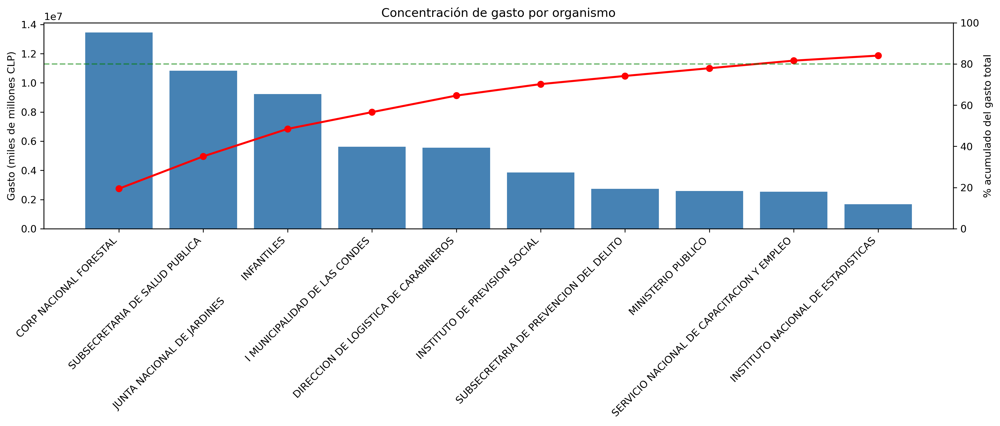
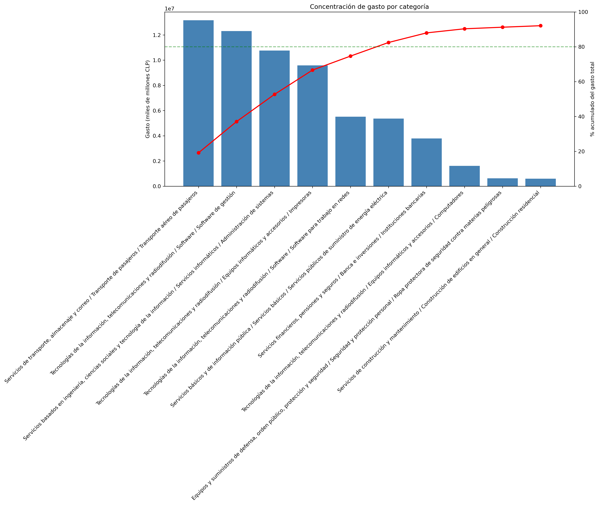
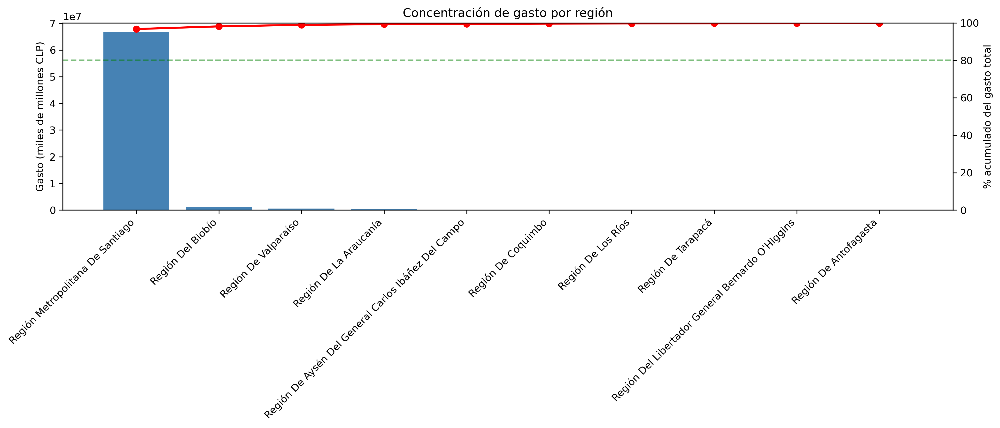
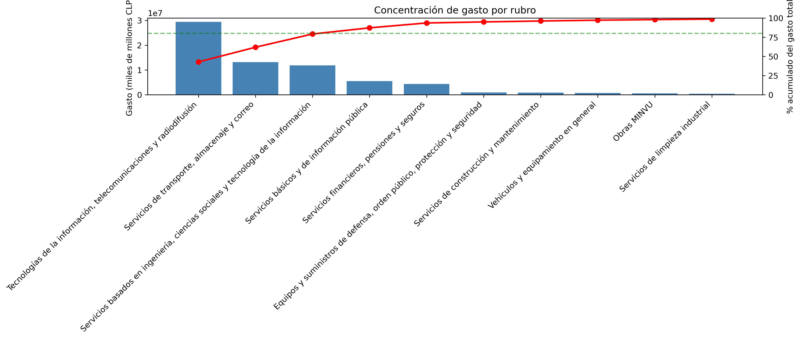

# Análisis del Gasto Público en Mercado Público de Chile

**¿Cómo y dónde gasta el Estado chileno a través de Mercado Público, y dónde están las mejores oportunidades para un proveedor?**

Análisis exploratorio (EDA) de ~1,1 millones de órdenes de compra pública del primer trimestre de 2026, orientado a una pregunta de negocio concreta: identificar patrones de gasto, concentración geográfica y nichos de mercado accesibles para un proveedor que busca entrar a la compra pública.

> 🛠️ **Stack:** Python · pandas · NumPy · Matplotlib · Seaborn · Jupyter  
> 📊 **Tipo:** Análisis exploratorio de datos (EDA) con enfoque de negocio  
> 🗂️ **Fuente:** Datos abiertos de Mercado Público (ChileCompra)

---

## 🎯 La pregunta

El Estado de Chile compra bienes y servicios por billones de pesos al año a través de Mercado Público. Para un proveedor que quiere venderle al Estado, la pregunta clave es: **¿dónde conviene entrar?** Este proyecto descompone esa pregunta en tres dimensiones:

1. **¿Cómo gasta el Estado?** — ¿de forma concentrada o distribuida?
2. **¿Dónde gasta?** — distribución por región, sector y categoría.
3. **¿Qué oportunidades existen?** — nichos con alto gasto y baja competencia.

---

## 💡 Hallazgos principales

**1. El gasto está fuertemente concentrado en los organismos top.**  
El **Top 10 de organismos** concentra el **84,1%** del gasto total, liderado de manera individual por **CONAF** (19,5%). Aunque a nivel transaccional existe una gran fragmentación operativa (valor mediano de $919,16K CLP), el volumen monetario lo mueven megatransacciones de alto valor.

**2. Centralización extrema en la Región Metropolitana.**  
La **Región Metropolitana** absorbe el **96,7%** del gasto registrado ($66,82 Cuadrillones de CLP), fuertemente influenciada por la facturación centralizada en casas matrices y ministerios, dejando solo un 3,3% distribuido entre las otras 15 regiones.

**3. El gasto por sector está liderado por TI y Transporte.**  
**Tecnologías de la Información (TI)** lidera por industria con un **42,8%** del gasto, mientras que **Transporte y Logística** es la categoría individual con mayor volumen (**19,2%** / $13,17 Cuadrillones de CLP). Los 5 sectores principales concentran el 93,7% del presupuesto total.

**4. Alto gasto con pocos proveedores suele señalar un mercado cerrado.**  
Los rubros de alto gasto con muy pocos proveedores corresponden a **mercados cautivos u oligopolios** (ej. Servicios Financieros, Maquinaria Minera) con barreras de entrada extremas. Las oportunidades reales están en **nichos abiertos y dinámicos** con alto flujo de órdenes y liquidez distribuida, como *Transporte y Almacenamiento* ($140,09T por proveedor) y *TI y Telecomunicaciones*.

---

## 🔍 Decisiones técnicas destacadas

Más allá de los resultados, el proyecto documenta el proceso de razonamiento. Algunas decisiones que muestran el criterio aplicado:

- **Grano de datos.** Cada fila es un ítem, no una orden. Se distinguió el monto por línea (`totalLineaNeto`) del monto total de la orden (`MontoTotalOC`, que se repite en cada línea) para evitar inflar los totales por doble conteo.
- **Reconciliación de columnas monetarias.** La brecha ~2x entre ambas columnas se investigó y resultó ser **IVA** (orden = bruto, línea = neto), no un error de datos. Validado mirando órdenes individuales.
- **Limpieza de datos reales.** Encoding `Latin-1`, separador `;`, coma decimal chilena (`1.234,56`), y verificación de moneda (99,4% CLP) antes de sumar.
- **Normalización de entidades.** Las regiones venían con **32 etiquetas distintas para 16 regiones reales** (espacios invisibles, homóglifos, nombres cortos vs. largos). Se consolidaron con normalización Unicode y match por palabra clave.
- **Métrica de concentración.** Se construyó un indicador (`pct_lider`: % del gasto que captura el proveedor líder) para distinguir mercados abiertos de cautivos — la clave para responder la pregunta de oportunidades.
- **Calidad de datos.** Los registros sin clasificar (10,6%) se investigaron por proporción, no por conteo: el patrón resultó ser falla de captura en servicios locales de educación (100% sin clasificar) y opacidad parcial en un organismo de seguridad (Gendarmería, 61%), no confidencialidad generalizada.
- **Disciplina de trabajo.** *"Diagnosticar antes de corregir"*: cada anomalía se verificó con datos crudos antes de aplicar una corrección, evitando arreglar fantasmas.
- **Jerarquía de clasificación.** `RubroN1` es la categoría madre y `Categoria` su subdivisión (un sector agrupa varias categorías). Por eso el gasto se concentra más al agrupar por sector que por categoría: el mismo dinero se reparte entre más casillas al bajar de nivel. Ambas dimensiones se analizan por separado para no confundir el nivel de agregación.

---

## 📈 Visualizaciones

### Dashboard interactivo (Power BI)

  
*Dashboard interactivo construido en Power BI: gasto total, top 10 organismos, distribución regional en mapa, y filtro por sector. Al seleccionar un sector, todos los visuales se recalculan en tiempo real.*

**Gasto por organismo — concentración en la cabeza**  
  
*El Top 10 de organismos concentra el 84,1% del gasto, liderado por CONAF (19,5%). La curva se aplana rápido: pocos organismos explican una porción desproporcionada, con una cola larga de cientos de compradores menores.*

**Gasto por categoría — distribuido**  
  
*Transporte y Logística lidera como categoría individual (19,2%). El mapa de categorías muestra dónde se dispersa la liquidez operativa.*

**Gasto por región — fuerte concentración geográfica**  
  
*La Región Metropolitana concentra el 96,7% del gasto debido al sesgo de facturación centralizada en casas matrices y ministerios.*

**Gasto por sector — concentrado en sectores clave**  
  
*Tecnologías de la Información lidera con el 42,8% del gasto total por industria, y los 5 sectores principales concentran el 93,7% del presupuesto.*

---

## 📂 Estructura del repositorio

```
.
├── notebooks/
│   ├── 01_cleaning_mercado_publico_eda.ipynb        # Carga y limpieza
│   └── 02_analyze_mercado_publico_eda.ipynb         # Análisis completo
├── assets/                      # Gráficos exportados
├── data/                        # (no incluida: datos públicos de ChileCompra)
├── dashboard/                   # Dashboard en Power BI        
├── reports/  
│   ├── executive_summary.es.md
│   └── executive_summary.md
├── README.es.md
└── README.md
```

> Los datos no se incluyen por tamaño; son descargables públicamente desde el portal de datos abiertos de Mercado Público (ChileCompra).

---

## 🧰 Herramientas

| Categoría | Herramientas |
|---|---|
| Lenguaje | Python 3.13 |
| Manipulación de datos | pandas, NumPy |
| Visualización | Matplotlib, Seaborn, **Power BI** |
| Dashboard | **Power BI Desktop** |
| Entorno | Jupyter Notebook, VS Code, Git |

---

## 👤 Autor

**Oscar Araya Díaz**  
Analista de Datos · Santiago, Chile 🇨🇱

[](https://www.linkedin.com/in/oscar-araya-diaz-7a418a170)
[](https://github.com/oscararayaoad-sys)
[](mailto:oscar.araya.oad@gmail.com)

**Certificaciones:**
- Google Advanced Data Analytics
- Google Data Analytics
- Análisis de Datos — AIEP *(en curso, 08-2026)*
