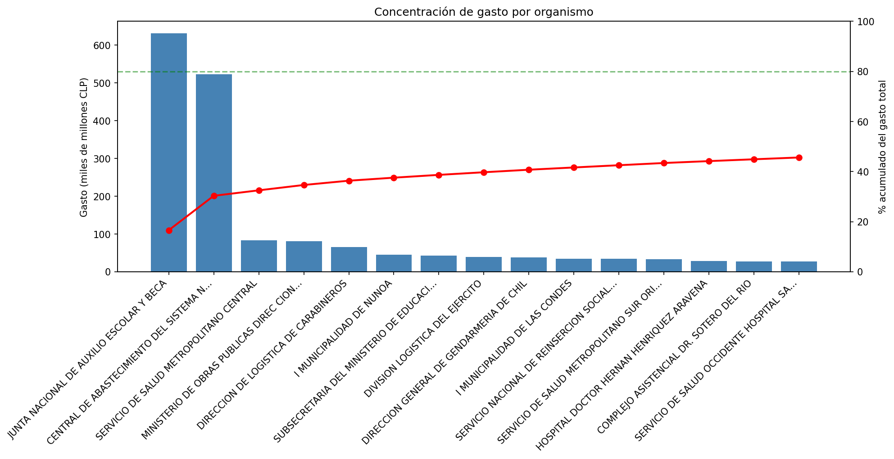
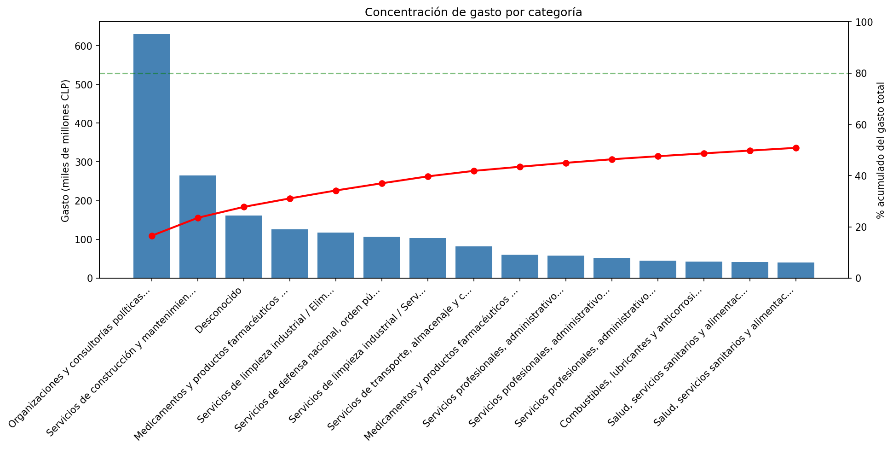
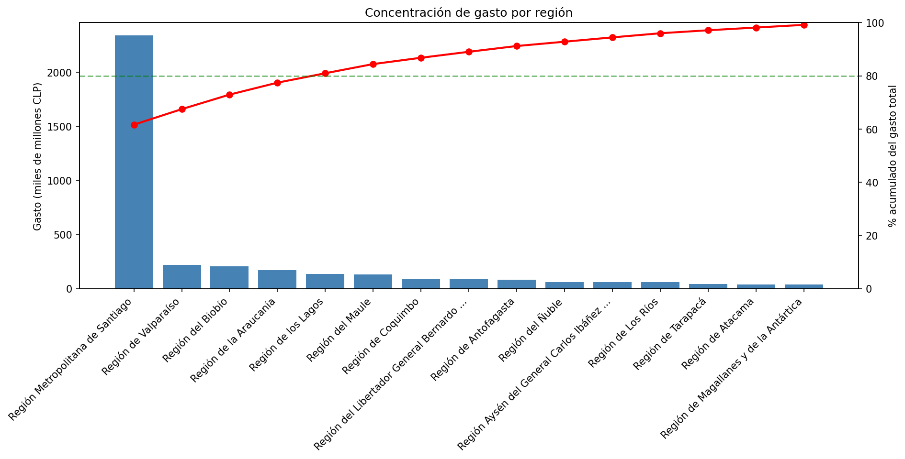
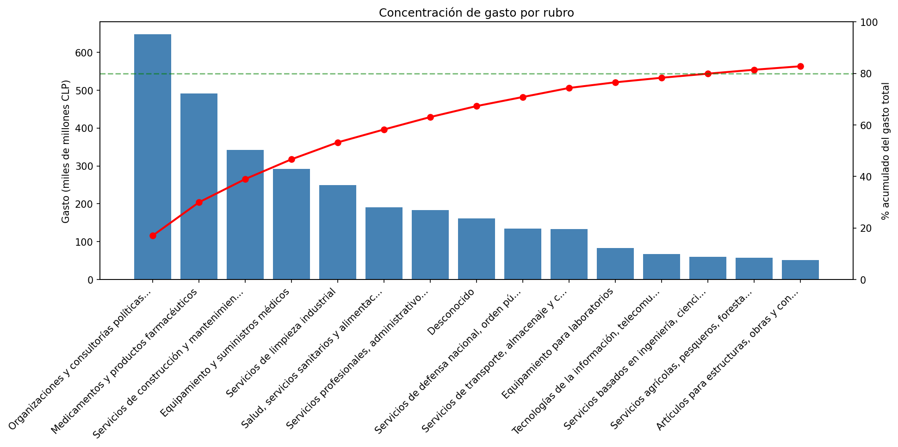

# Análisis del Gasto Público en Mercado Público de Chile

**¿Cómo y dónde gasta el Estado chileno a través de Mercado Público, y dónde están las mejores oportunidades para un proveedor?**

Análisis exploratorio (EDA) de ~1,1 millones de órdenes de compra pública del primer trimestre de 2026, orientado a una pregunta de negocio concreta: identificar patrones de gasto, concentración geográfica y nichos de mercado accesibles para un proveedor que busca entrar a la compra pública.

> 🛠️ **Stack:** Python · pandas · NumPy · Matplotlib · Seaborn · Jupyter
> 📊 **Tipo:** Análisis exploratorio de datos (EDA) con enfoque de negocio
> 🗂️ **Fuente:** Datos abiertos de Mercado Público (ChileCompra)

---

## 🎯 La pregunta

El Estado de Chile compra bienes y servicios por billones de pesos al año a través de Mercado Público. Para un proveedor que quiere venderle al Estado, la pregunta clave es: **¿dónde conviene entrar?** Este proyecto descompone esa pregunta en tres dimensiones:

1. **¿Cómo gasta el Estado?** — ¿de forma concentrada o distribuida?
2. **¿Dónde gasta?** — distribución por región, rubro y categoría.
3. **¿Qué oportunidades existen?** — nichos con alto gasto y baja competencia.

---

## 💡 Hallazgos principales

> *(Confirmar las cifras exactas contra la versión final del notebook antes de publicar.)*

**1. El gasto está concentrado en la cabeza y distribuido en la cola.**
Los dos organismos mayores (JUNAEB y CENABAST) concentran cerca del **30%** del gasto total, y el top 10 alcanza el **~42%**. La gran mayoría de las órdenes son pequeñas; un grupo reducido de órdenes grandes acumula el grueso del dinero.

**2. La Región Metropolitana domina geográficamente.**
La RM concentra el **~62%** del gasto. El top 5 de regiones alcanza el **~81%**. La concentración geográfica es mucho más fuerte que la concentración por categoría.

**3. El gasto por rubro está distribuido, no concentrado.**
El top 10 de rubros apenas llega al **~74%** del gasto — el umbral del 80% recién se alcanza cerca del top 14. Esto indica un mercado amplio, con múltiples oportunidades en vez de un único sector dominante.

**4. "Pocos proveedores" NO significa oportunidad.**
El hallazgo más contraintuitivo: los nichos de alto gasto con pocos proveedores resultaron ser **mercados cautivos** (equipamiento nuclear, radioterapia, radioisótopos), con un proveedor líder que captura más del **90%** del gasto — barreras de entrada altas, no oportunidades. Las oportunidades reales están en mercados de gasto alto con competencia media y líder débil (<50%): diagnóstico médico, publicidad, maquinaria forestal.

---

## 🔍 Decisiones técnicas destacadas

Más allá de los resultados, el proyecto documenta el proceso de razonamiento. Algunas decisiones que muestran el criterio aplicado:

- **Grano de datos.** Cada fila es un ítem, no una orden. Se distinguió el monto por línea (`totalLineaNeto`) del monto total de la orden (`MontoTotalOC`, que se repite en cada línea) para evitar inflar los totales por doble conteo.
- **Reconciliación de columnas monetarias.** La brecha ~2x entre ambas columnas se investigó y resultó ser **IVA** (orden = bruto, línea = neto), no un error de datos. Validado mirando órdenes individuales.
- **Limpieza de datos reales.** Encoding `Latin-1`, separador `;`, coma decimal chilena (`1.234,56`), y verificación de moneda (99,4% CLP) antes de sumar.
- **Normalización de entidades.** Las regiones venían con **32 etiquetas distintas para 16 regiones reales** (espacios invisibles, homóglifos, nombres cortos vs. largos). Se consolidaron con normalización Unicode y match por palabra clave.
- **Métrica de concentración.** Se construyó un indicador (`pct_lider`: % del gasto que captura el proveedor líder) para distinguir mercados abiertos de cautivos — la clave para responder la pregunta de oportunidades.
- **Calidad de datos.** Los registros sin clasificar (10,6%) se investigaron por proporción, no por conteo: el patrón resultó ser falla de captura en servicios locales de educación (100% sin clasificar) y opacidad parcial en un organismo de seguridad (Gendarmería, 61%), no confidencialidad generalizada.
- **Disciplina de trabajo.** *"Diagnosticar antes de corregir"*: cada anomalía se verificó con datos crudos antes de aplicar una corrección, evitando arreglar fantasmas.

---

## 📈 Visualizaciones

**Gasto por organismo — concentración en la cabeza**

*JUNAEB y CENABAST encabezan el gasto y juntos concentran cerca del 30%. La curva se aplana rápido: pocos organismos explican una porción desproporcionada, con una cola larga de cientos de compradores menores.*

**Gasto por categoría — distribuido**

*Ninguna categoría domina. El 80% acumulado ni siquiera se alcanza en el top 15, señal de un mercado amplio con múltiples frentes de oportunidad.*

**Gasto por región — fuerte concentración geográfica**

*La Región Metropolitana concentra el ~62% del gasto. El 80% acumulado se alcanza recién en el top 5: el gasto público está geográficamente concentrado, a diferencia de su distribución por categoría.*

**Gasto por rubro — distribuido**

*El gasto por rubro se reparte entre muchos sectores; el 80% acumulado se alcanza recién cerca del top 14, confirmando un mercado abierto.*

---

## 📂 Estructura del repositorio

```
.
├── notebooks/
│   └── 01_carga.ipynb        # Carga, limpieza y análisis completo
├── img/                      # Gráficos exportados
├── data/                     # (no incluida: datos públicos de ChileCompra)
└── README.md
```

> Los datos no se incluyen por tamaño; son descargables públicamente desde el portal de datos abiertos de Mercado Público (ChileCompra).

---

## 🧰 Herramientas

| Categoría | Herramientas |
|---|---|
| Lenguaje | Python 3.13 |
| Manipulación de datos | pandas, NumPy |
| Visualización | Matplotlib, Seaborn |
| Entorno | Jupyter Notebook, VS Code |

---

## 👤 Autor

**Oscar Araya Díaz**
Analista de Datos · Santiago, Chile 🇨🇱

[](https://www.linkedin.com/in/oscar-araya-diaz-7a418a170)
[](https://github.com/oscararayaoad-sys)
[](mailto:oscar.araya.oad@gmail.com)

**Certificaciones:**
- Google Advanced Data Analytics
- Google Data Analytics
- Análisis de Datos — AIEP *(en curso, 08-2026)*